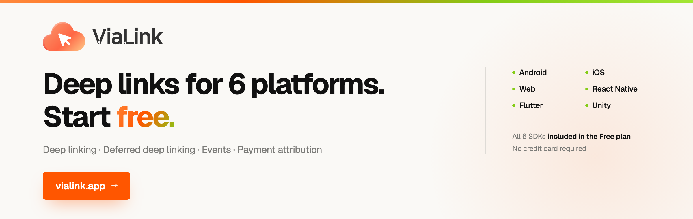

# ViaLink iOS SDK

[](https://vialink.app)

**English** | [한국어](README.ko.md)

iOS SDK for the ViaLink deep link infrastructure service.

One link routes automatically across iOS, Android, and Web. When the app is not
installed, the user is sent to the App Store and still lands on the intended screen on
first launch (deferred deep linking). Click, install, open, event, and payment all flow
through a single attribution pipeline.

Unlike most deep link and attribution tools, which require a sales call and an annual
contract, **ViaLink is free to start.** No credit card — all six platform SDKs are
available the moment you sign up.

**→ [vialink.app](https://vialink.app)**

## Features

- **Deep link routing** — automatic handling of Universal Links / Custom URL Schemes
- **Deferred deep linking** — fingerprint-based matching on the first launch after install
- **Event tracking** — batched delivery of custom events
- **Payment attribution** — records payment attempts and automatically attaches `link_id`
- **Link creation** — generate deep links from within the app (static/dynamic)

## Requirements

- iOS 15.0+
- Swift 5.9+
- Xcode 15+

## Installation

### Swift Package Manager

```
Xcode > File > Add Package Dependencies
URL: https://github.com/aresjoydev/vialink-ios-sdk
```

## Usage

### 1. Initialization and receiving links

```swift
import ViaLinkCore

@main
struct iosApp: App {
    init() {
        ViaLinkSDK.shared.configure(apiKey: "YOUR_API_KEY")
    }

    var body: some Scene {
        WindowGroup {
            ContentView()
                .onOpenURL { url in
                    // Receive a Custom URL Scheme
                    ViaLinkSDK.shared.handleURL(url)
                }
                .onContinueUserActivity(NSUserActivityTypeBrowsingWeb) { userActivity in
                    // Receive a Universal Link
                    ViaLinkSDK.shared.handleUniversalLink(userActivity)
                }
        }
    }
}
```

### 2. Deep link callbacks

```swift
// Receive Universal Links / custom schemes
ViaLinkSDK.shared.onDeepLink { data in
    print("path: \(data.path)")
    print("params: \(data.params)")
}

// Deferred deep link (matched after the first install)
ViaLinkSDK.shared.onDeferredDeepLink { data, error in
    if let error = error {
        print("match failed: \(error.message)")
        return
    }
    if let data = data {
        print("deferred: \(data.path)")
    } else {
        print("no match (organic)")
    }
}
```

### 3. Pull API

```swift
// Synchronous (returns the cached value immediately)
let deepLink = ViaLinkSDK.shared.getDeepLinkData()
let deferred = ViaLinkSDK.shared.getDeferredLinkData()

// Asynchronous (waits until the result arrives)
Task {
    let deepLinkAsync = try? await ViaLinkSDK.shared.awaitDeepLinkData()    // 3-second timeout
    let deferredAsync = try? await ViaLinkSDK.shared.awaitDeferredLinkData() // first launch: waits for the match result / later launches: returns nil immediately
}
```

### 4. Event tracking

```swift
ViaLinkSDK.shared.track("purchase", data: [
    "product_id": "12345",
    "revenue": "29900",
    "currency": "KRW"
])
```

### 5. Payment tracking

```swift
Task {
    do {
        let result = try await ViaLinkSDK.shared.payment.initiated(
            PaymentInitiatedArgs(
                orderId: "ORDER-1234",
                amount: 29900,
                currency: "KRW",
                paymentMethod: "apple_pay"
            )
        )
        print("Success: \(result.success), EventId: \(result.paymentEventId)")
    } catch {
        print("Payment Error: \(error.localizedDescription)")
    }
}
```

### 6. Link creation

```swift
Task {
    do {
        let url = try await ViaLinkSDK.shared.createLink(
            path: "/product/12345",
            data: ["promo_code": "FRIEND_SHARE"],
            campaign: "referral",
            linkType: "dynamic" // when click tracking is needed
        )
        print("created link: \(url)")
    } catch {
        print("creation failed: \(error.localizedDescription)")
    }
}
```

## Sample project

See the runnable Xcode sample project in the `sample/ViaLinkSample/` directory.

## Documentation

- [SDK Guide](https://docs.vialink.app/#sdk-ios-install)

## License

MIT License — Aresjoy Inc.
